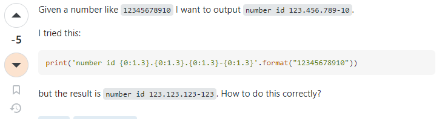

# Ask a question: The SMART Way

A smart way of asking a question contains providing a clear context, being detailed, and be DIRECT. It doesn’t matter what type of question you’re asking. To do that, you also need to know what kind of information you’re looking for and “WHO” is the best person to ask. Not knowing these two basic things is like bringing a knife to a gunfight. Remember, if you need an answer, you better know how to ask (the SMART WAY). After reading “How To Ask Questions The Smart Way” by Eric Steven Raymond’s, I realized the important things to consider when asking questions to get the RIGHT answers.

## What is the SMART Way?

In programming, asking a question is not a one-way street. A programmer needs to know the NEEDS before asking a question. According to Eric, a programmer needs to research, read, experiment, ask a skilled friend, and read the source code. Spoon-feeding someone with information leads to laziness and bad production. Once you ask a question, a SMART question in a SMART way, you must have initiative to put in effort to get the right and SMART answer/information you needed. For example, this [question](https://stackoverflow.com/questions/77071412/how-to-handle-data-storage-in-cypress-e2e-testing) the user is asking the SMART way of a question because it provided well-constructed and a clear context for the problem the user is facing with end-to-end (E2E) testing in Spring backend and Angular frontend using Cypress. It was mentioned the concerns about data storage, testing databases, and mocking HTTP responses, which are all relevant aspects to consider when setting up E2E tests. This kind of question is expected to have helpful responses because it was outlined correctly with the steps taken by the user to try and solve the specific challenges, and now looking for help on “what” is best approach to tackle them. It shows that the user thought about the problem, took initiative to think what could happen once he run tests, and importantly, even being overwhelmed, the user is not afraid to approach what's the best way to take in that situation. The user also used Stack Overflow to ask people regarding this matter in order to get answers. Considering Stack Overflow is one of the resouces the user can use. This is the SMART way to engage with a development community or forum.

## Not-so SMART way

     
Asking a question with incomplete information can lead in wrong answers. We need to remember that people have different ideas and thoughts. Before asking a question, we must think, “is there a better way to ask this question?” For this [question](https://stackoverflow.com/questions/50067307/use-a-formatted-string-to-separate-groups-of-digits) there could be a better way to ask this question. Instead of saying *I tried this* then provide the code after with a question, there could be more information added to it as well. For example, what did you expect it to do? What have you already tried? Did you only try it once? If the answer is yes, then you should indicate it with the result. If you tried more then, next question would be, what happened in those attempts? Did you do any research? If you did, you should provide it too. Asking a question should be spoon-feeding. This should be a trial-and-error, and if you can’t still fix it, then ask! *The SMART way* Be detailed: in particular, if something didn’t work, don’t just state that: tell us how it failed. In programming, this is also an important question. If it threw an exception, what was the exception? Do not just indicate the type give the error message and say which line threw it. 

## Conclusion: SMART questions lead to SMART answers

In conclusion, asking smart questions is a vital part especially for us, programmers, because it allows us to get the closest and right answers they we should get to solve our problems. By being precise, understanding context, asking the right question, and thinking critically about the question we have, we can use other people’s deeper insights, knowledge, and foster meaningful connections within the community. 
