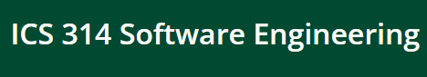

  As I look back at my ICS 314 class, I am really amazed how I learned a lot. I was able to see the difference and compare JavaScript to other programming languages. I was able to explore JavaScript, a dynamic language used for web development, regardless of my background in coding. Unlike Java, which is robust and generally used for applications, JavaScript is lightweight and ideal for building interactive web content. Throughout this class, I was able to learn JavaScript's syntax, capabilities, and its role in modern web development. Despite similarities in names, Java and JavaScript serve different purposes. I was not just able to see the differences, but I was introduced to Bootstrap, Meteor, MongoDB, and React. This journey opened doors for me to learn a dynamic and versatile language.
  
# Dynamic Project Coordination: Embracing Agile Principles
  This is a way of working that’s flexible and focuses on teamwork. It’s not only for web stuff but for any project. For example, for our group project, we were able to break the work into smaller tasks and adjust things as needed along the way. Embracing Agile principles has taught me the value of constant adaptation, enabling teams to respond effectively to changes and deliver high-quality outcomes in a collaborative environment. But take note, this needs to be properly coordinated and have communication with your group!

# Solving Software Problems: The Magic of Design Patterns
  This fundamental software engineering concept really helped me get through this semester. Smart ways to solve common problems when building software. One thing I introduced to my groupmates is making a flowchart before we did our website. It really helped us a lot since it’s like the blueprint of our website. They’re like templates that can be used in different types of programs. They’re handy in all sorts of software, not just web applications. Design patterns offer proven and reusable solutions to typical challenges encountered during software development, organizing the creation process by providing established blueprints for problem-solving. 
  
# Integrity in Software Engineering: Upholding Ethical Standards
  Doing the right and fair thing matters in all software work, not just web apps. It means keeping data safe and making sure what we make is fair for everyone who uses it. These ethics are crucial for any kind of software we create, ensuring trust and fairness for all users.

# Conclusion
  Understanding these things helps software engineers in making all sorts of computer programs, not just websites. They’re like tools that were provided to us. It is our guide that we must follow or apply in our programming life. These are the building blocks of making good and fair software, no matter what it’s for. In conclusion, while Java and JavaScript share similar names, they cater to distinct domains within the realm of programming. But for ICS 314, it thought me that JavaScript can be used as a versatile tool for dynamic web content, showcasing the diversity and specialized roles each language plays in software.
