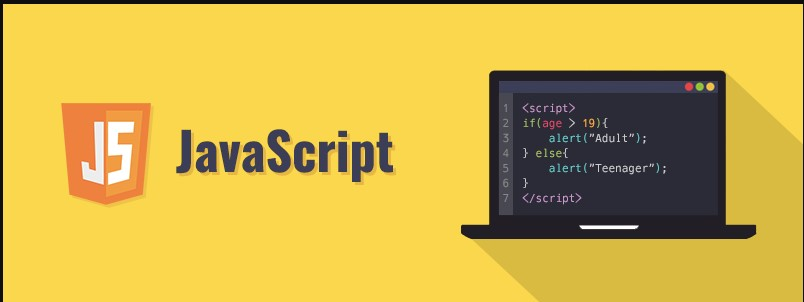

Learning Javascript: The Beginning Journey

  The beginning is always the hard part.  I know that my journey with JavaScript has been and will be a huge challenge, but at the same time, a rewarding experience. It has been a long time since I’ve programmed an online t-shirt shop using HTML, and ofcourse, a bit of CSS. As a beginner in Javascript programming, I’ve run into a lot of problems. For example, having to change from Windows to MacOS. I had to follow what is recommended for programming in different IDE’s. I didn’t know what the difference between coding in Windows is using Javascript vs using MacOS using the same language. I might have to learn more as I progress in this journey. 

  As I progress through this rough journey, I am starting to appreciate the uniqueness of Javascript and will continue to do so. 
One of the starting bumps I faced with JavaScript is the re-learn the basics. Watching video tutorials, reading our notes, and having to attend WOD’s and learn from it. Coming from a background in languages like Java and Python, this is the time where I am facing the time where I really must put in a lot of time relearning again. Java is one of the simple languages as it does not have any complex features like pointers and multiple inheritances. The problem I can see with these differences is the problem of having typos and case errors. 

  One solution to this bump is the ability to access freecodecamp.org as for our virtual book. It guides me to learn the do and don’ts, and especial features like ES6 helped to run it flawlessly. This Javascript ES6 version helped me understand the features that I can in my programs. For example, having to know the differences between let, var, and const.
Practice WOD’s or Workout of the day has been helpful in this rough journey. These exercises allow us to improve and learn more about how programs work. Attending our TA’s WOD has been a big help, as it almost prepares me to our graded WOD. What did I learn from this? I learned how to work under the pressure, helped me think more, and learn to be always ready.

  In conclusion, my journey with JavaScript has its own pro's and con's, rough and straight roads, but I am strong-minded and eager to learn more. Conquering the fear of what “I can’t”, and turning them to strengths of what “I can” will always be my motto for JavaScript.
