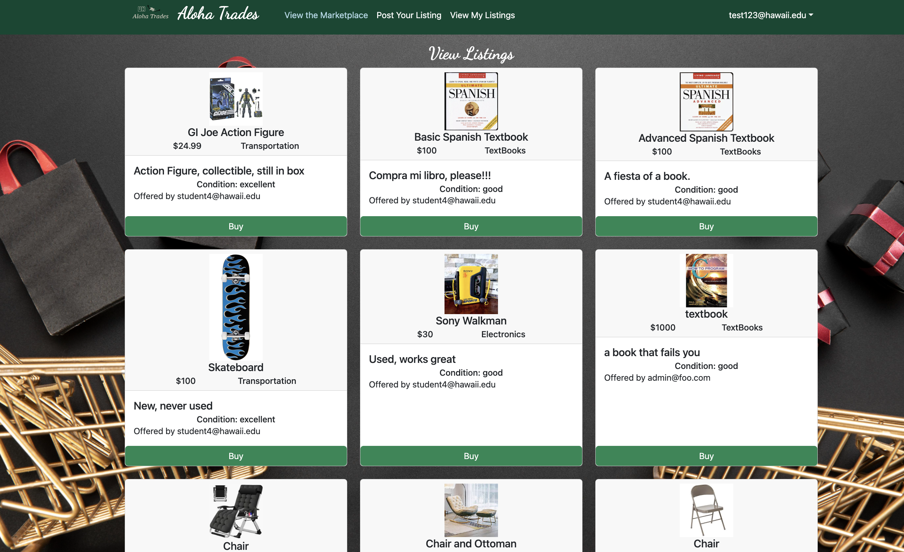
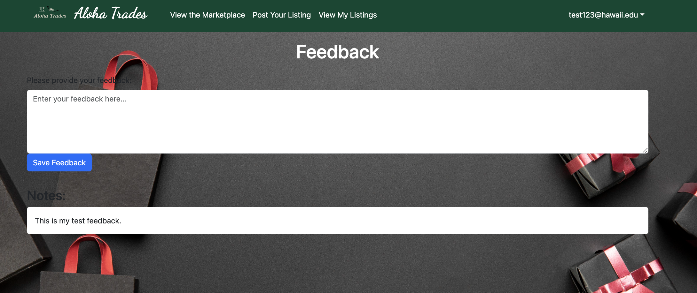
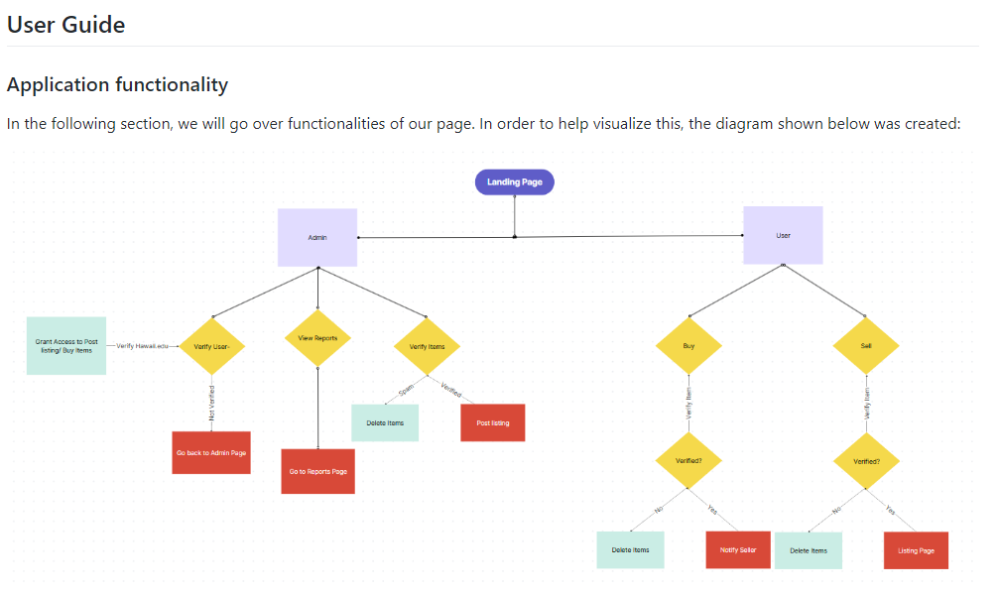

# Aloha Trades: "Your College Marketplace

# Overview

## Purpose

  A final project directive detailing the use of a meteor-react template and the creation of an exclusive flea market website solely for University of Hawaii students and faculty. The concept resembled Craigslist or Facebook Marketplace, but specifically tailored for transactions within the university community. Given the common scenario of students and faculty needing to part with gently used items as they move out of dorms or complete semesters, this platform aimed to facilitate these exchanges among the university members.

  Driven by the project directive, we customized the template by imposing specific limitations. Our goal was to streamline item categories and restrict user sign-ups to those with @hawaii.edu email addresses. To maintain a secure environment, every posted listing underwent rigorous scrutiny and approval by an administrator to prevent any potentially inappropriate or unauthorized content from being visible to users.

## Contributions

  This project was a joint endeavor alongside three other classmates. During our initial discussions, we delved into our ideas for the website's design, functionality, and user experience. My specific contributions were clear-cut: I advocated for mandatory account access, stipulating that users must register using a hawaii.edu email address to enhance student safety. Additionally, signing in required the use of the @hawaii.edu email.

  We proceeded by outlining the essential pages and components vital for the site's core operations. My responsibilities encompassed setting up the Feedback page for student reviews and queries, integrating the marketplace icon, designing the student landing page, and, significantly, constructing our flowchart, which served as the blueprint guiding the website's development.

## I learned that: 

  This project underscored the importance of effective communication within a team bustling with diverse ideas and limited time. It taught me the art of decision-making, prioritizing tasks to drive progress swiftly while aligning with our overarching goals. Furthermore, it served as a platform to solidify our understanding of agile project development, configuration management, deployment, and testing, all integral topics covered in our class. It thought me that Agile development's emphasis on manageable tasks within short timeframes ensured seamless progress without obstructing others' contributions. Utilizing GitHub for configuration management facilitated easy collaboration, allowing branching for feature additions without disrupting the main codebase. Early on, our team grappled with divergent visions for the project, resulting in incompatible code that needed restructuring. But after talking through things that we can assign to each other to specifically work on, we got the grasp on how we make our task easier and do it flawlessly. Implementing an Agile workflow enabled us to craft a cohesive experience through a detailed flowchart, dividing tasks across milestones while maintaining transparent communication about ongoing changes.
  
[Aloha Trades Webpage](https://aloha-trades.com/)

[Aloha Trades Organization Page](https://aloha-trades.github.io/)

[Aloha Trades Organization Page (GitHub)](https://github.com/aloha-trades)
