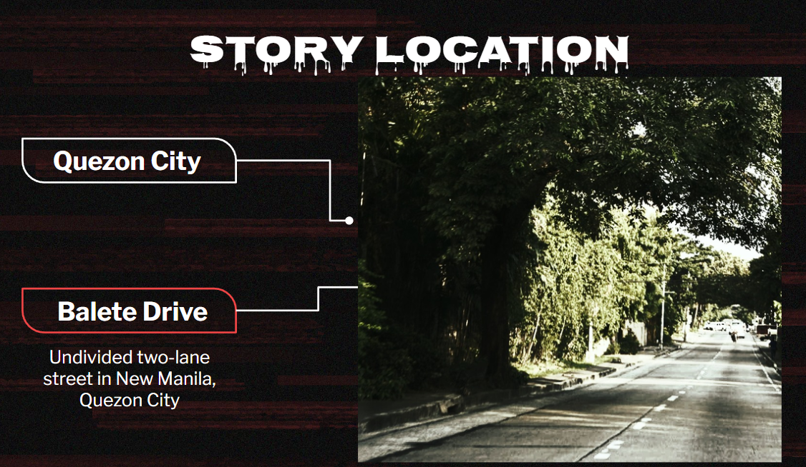

## Mystery of Balete Tree

Last semester, I did a research in Philippine Mythology for my final presentation. This research is about the mystery of Balete Tree. What could be inside this? Spooky!!
The Balete tree is considered a mysterious tree in Philippine culture. There are plenty of superstitious beliefs connected to this tree. These beliefs are typically shared through stories, books, and movies. These beliefs can be different depending on the location. One belief is this tree is a place for Tree Demon.
Balete tree is considered as a place for Tree Demon. In Philippine mythology, the Tree Demon is a creature that may be described as a tree giant. They are said to be 7-9 feet tall, dark-coloured, hairy, and muscular creatures. Tree Demon are said to have a very strong body odor. Some people also believe that “Tree Demon are normally described as having a strong smell that would attract human attention” 

Respect everything you see in the nature, you don't know what is hiding under or above it.

