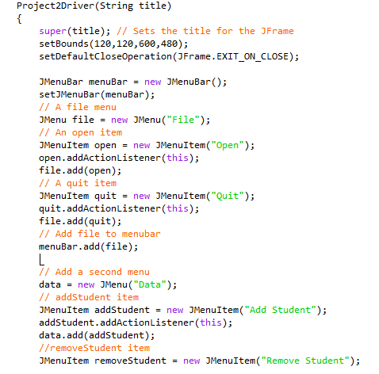

Description:
The Student Registration Program was my final project in Polytechnic University of the Philippines. It is designed to find, add, delete, and enroll a student. This program has been tested to register in 4 classes. It has an Admin and Student panels, different courses codes, and payment information. I used Java to code this and Visual Studio for my IDE

Key Features:
ADMIN:
1) Admin has different options like find, add, delete, and enroll a student. 
2) Admin can also see how many classes a specific student is taking.
3) Admin can also have an option to "PRINT" the information of a student.

STUDENT:
1) Student/s can enroll to a subject, see the payment information, and update their information.
2) Student/s can also see the grading system, available classes ( 4 maximum), and print their information.
